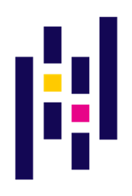
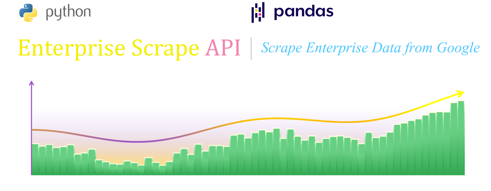
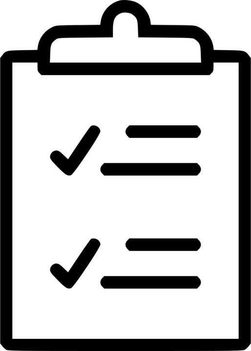

<table align="center" style="border-top:1px solid lightgrey">
    <tr>
        <td style="background-color:white">
            <table align="left">
                <tr>
                    <td style="background-color:white">
                        
                    </td>
                    <td style="background-color:white">
                        
                    </td>
                </tr>
            </table>
        </td>
        <td colspan="2" style="background-color:white">
            <table align="left">
                <td style="background-color:white">
                    
                </td>
                <td style="background-color:white">
                    
                </td>
            </table>
        </td>
    </tr>
    <tr>
        <td style="background-color:white">
            <span style="color:#F4EE00; font-family:cambria; font-size:50px">Enterprise Scrape </span>
            <span style="color:#F386AF; font-family:cambria; font-size:50px">API</span>
        </td>
        <td style="background-color:white">
            <span style="color:lightgrey; font-family:cambira; font-size:50px">|</span>
        </td>
        <td style="background-color:white">
            <span style="color:#53C8FE; font-family:cambira; font-size:30.9px">
                <i>Scrape Enterprise Data from Google</i>
            </span>
        </td>
    </tr>
    <tr style="border-bottom:1px solid lightgrey">
        <td colspan="3" style="background-color:white">
            
        </td>
    </tr>
    <tr>
        <td colspan="3" style="background-color:white">
            <a style="float:left" href="https://github.com/zachary-chiodini/enterprise_scrape">Link to Repository</a>
        </td>
    </tr>
</table>

<table align="left">
    <tr>
        <td style="background-color:white; border-bottom:1px solid lightgrey" align="center">
            
        </td>
        <td style="background-color:white; border-bottom:1px solid lightgrey" 
            align="center">
            <span style="font-size:19px"><b><i>Dependencies</i></b></span>
        </td>
    </tr>
    <tr>
        <td style="background-color:white">
            
        </td>
        <td style="background-color:white">
            
        <td>
    </tr>
    <tr>
        <td style="background-color:white">
            
        </td>
        <td style="background-color:white">
            
        </td>
    </tr>
</table>

<hr>
<i style="font-size:15.9px">Import Scrape from the "enterprise_scrape.py" module:</i>
<hr>


```python
from enterprise_scrape import Scrape
```

<hr>
<i style="font-size:15.9px">Send a query to Google, retrieve the source code and extract the search results:</i>
<hr>


```python
scrape = Scrape()
scrape.google( 'ibm company' )
scrape.getResult()
```


<div>
<style scoped>
    .dataframe tbody tr th:only-of-type {
        vertical-align: middle;
    }

    .dataframe tbody tr th {
        vertical-align: top;
    }

    .dataframe thead th {
        text-align: right;
    }
</style>
<table border="1" class="dataframe">
  <thead>
    <tr style="text-align: right;">
      <th></th>
      <th>Source</th>
      <th>Links</th>
      <th>Summary</th>
    </tr>
  </thead>
  <tbody>
    <tr>
      <th>0</th>
      <td>https://www.ibm.com</td>
      <td>ibm - united states</td>
      <td>for more than a century ibm has been dedicated...</td>
    </tr>
    <tr>
      <th>1</th>
      <td>https://www.ibm.com</td>
      <td>about ibm - united states</td>
      <td>collectively, they have fostered some of the c...</td>
    </tr>
    <tr>
      <th>2</th>
      <td>https://en.wikipedia.org</td>
      <td>ibm - wikipedia</td>
      <td>website. ibm.com. international business machi...</td>
    </tr>
    <tr>
      <th>3</th>
      <td>https://www.cbronline.com</td>
      <td>what is ibm? - computer business review</td>
      <td>international business machines (ibm), is a gl...</td>
    </tr>
    <tr>
      <th>4</th>
      <td>https://www.linkedin.com</td>
      <td>ibm | linkedin</td>
      <td>ibm is a leading cloud platform and cognitive ...</td>
    </tr>
    <tr>
      <th>5</th>
      <td>https://www.britannica.com</td>
      <td>ibm | founding, history, &amp;amp; products | brit...</td>
      <td>ibm (international business machines corporati...</td>
    </tr>
    <tr>
      <th>6</th>
      <td>https://money.cnn.com</td>
      <td>ibm - international business machines corp com...</td>
      <td>the company was founded by charles ranlett fli...</td>
    </tr>
    <tr>
      <th>7</th>
      <td>https://finance.yahoo.com</td>
      <td>international business machines (ibm) company ...</td>
      <td>international business machines corporation op...</td>
    </tr>
    <tr>
      <th>8</th>
      <td>https://searchitchannel.techtarget.com</td>
      <td>what is ibm? - definition from whatis.com - se...</td>
      <td>ibm is a global information technology company...</td>
    </tr>
    <tr>
      <th>9</th>
      <td>https://www.bloomberg.com</td>
      <td>international business machines corp - company...</td>
      <td>international business machines corporation (i...</td>
    </tr>
  </tbody>
</table>
</div>


<hr>
<i style="font-size:15.9px">Extract Information from Google's information box, if one exists:</i>
<hr>


```python
scrape.getBox()
```


<div>
<style scoped>
    .dataframe tbody tr th:only-of-type {
        vertical-align: middle;
    }

    .dataframe tbody tr th {
        vertical-align: top;
    }

    .dataframe thead th {
        text-align: right;
    }
</style>
<table border="1" class="dataframe">
  <thead>
    <tr style="text-align: right;">
      <th></th>
      <th>Info</th>
    </tr>
  </thead>
  <tbody>
    <tr>
      <th>wiki</th>
      <td>international business machines corporation is...</td>
    </tr>
    <tr>
      <th>ceo</th>
      <td>arvind krishna (apr 6, 2020–)</td>
    </tr>
    <tr>
      <th>customer service</th>
      <td>1 (877) 426-6006</td>
    </tr>
    <tr>
      <th>sales</th>
      <td>1 (888) 746-7426</td>
    </tr>
    <tr>
      <th>headquarters</th>
      <td>armonk, ny</td>
    </tr>
    <tr>
      <th>founder</th>
      <td>charles ranlett flint</td>
    </tr>
    <tr>
      <th>subsidiaries</th>
      <td>red hat software, ibm india private limited, w...</td>
    </tr>
  </tbody>
</table>
</div>


<hr>
<i style="font-size:15.9px">Find alternative names for the company, if they exist:</i>
<hr>


```python
scrape.assocComp( 'ibm' )
```


<div>
<style scoped>
    .dataframe tbody tr th:only-of-type {
        vertical-align: middle;
    }

    .dataframe tbody tr th {
        vertical-align: top;
    }

    .dataframe thead th {
        text-align: right;
    }
</style>
<table border="1" class="dataframe">
  <thead>
    <tr style="text-align: right;">
      <th></th>
      <th>Company Name</th>
    </tr>
  </thead>
  <tbody>
    <tr>
      <th>0</th>
      <td>international business machines</td>
    </tr>
    <tr>
      <th>1</th>
      <td>international business machines corp</td>
    </tr>
    <tr>
      <th>2</th>
      <td>ibm</td>
    </tr>
  </tbody>
</table>
</div>


<hr>
<i style="font-size:15.9px">Find parent companies:</i>
<hr>


```python
scrape.parentComp( 'skype' )
```


<div>
<style scoped>
    .dataframe tbody tr th:only-of-type {
        vertical-align: middle;
    }

    .dataframe tbody tr th {
        vertical-align: top;
    }

    .dataframe thead th {
        text-align: right;
    }
</style>
<table border="1" class="dataframe">
  <thead>
    <tr style="text-align: right;">
      <th></th>
      <th>Parent Company</th>
    </tr>
  </thead>
  <tbody>
    <tr>
      <th>0</th>
      <td>microsoft corporation</td>
    </tr>
  </tbody>
</table>
</div>


<hr>
<i style="font-size:15.9px">Find subsidiaries:</i>
<hr>


```python
scrape.childComp( 'skype' )
```


<div>
<style scoped>
    .dataframe tbody tr th:only-of-type {
        vertical-align: middle;
    }

    .dataframe tbody tr th {
        vertical-align: top;
    }

    .dataframe thead th {
        text-align: right;
    }
</style>
<table border="1" class="dataframe">
  <thead>
    <tr style="text-align: right;">
      <th></th>
      <th>Subsidiary</th>
    </tr>
  </thead>
  <tbody>
    <tr>
      <th>0</th>
      <td>groupme</td>
    </tr>
    <tr>
      <th>1</th>
      <td>microsoft development center rus llc</td>
    </tr>
    <tr>
      <th>2</th>
      <td>s technologies limited</td>
    </tr>
    <tr>
      <th>3</th>
      <td>skype software sar.l.</td>
    </tr>
  </tbody>
</table>
</div>


<hr>
<i style="font-size:15.9px">Get reviews:</i>
<hr>


```python
scrape.getReview( 'mcdonalds' )
```


<div>
<style scoped>
    .dataframe tbody tr th:only-of-type {
        vertical-align: middle;
    }

    .dataframe tbody tr th {
        vertical-align: top;
    }

    .dataframe thead th {
        text-align: right;
    }
</style>
<table border="1" class="dataframe">
  <thead>
    <tr style="text-align: right;">
      <th></th>
      <th>Source</th>
      <th>Votes</th>
      <th>Avg Rating</th>
    </tr>
  </thead>
  <tbody>
    <tr>
      <th>0</th>
      <td>https://www.consumeraffairs.com</td>
      <td>71</td>
      <td>1.8</td>
    </tr>
    <tr>
      <th>1</th>
      <td>https://www.facebook.com</td>
      <td>18</td>
      <td>1.6</td>
    </tr>
    <tr>
      <th>2</th>
      <td>https://www.tripadvisor.com</td>
      <td>5</td>
      <td>3.0</td>
    </tr>
    <tr>
      <th>3</th>
      <td>https://www.tripadvisor.com</td>
      <td>3</td>
      <td>3.5</td>
    </tr>
    <tr>
      <th>4</th>
      <td>https://www.yelp.com</td>
      <td>46</td>
      <td>3.0</td>
    </tr>
    <tr>
      <th>5</th>
      <td>https://www.yelp.com</td>
      <td>39</td>
      <td>3.0</td>
    </tr>
    <tr>
      <th>6</th>
      <td>https://www.trustpilot.com</td>
      <td>1875</td>
      <td>1.9</td>
    </tr>
    <tr>
      <th>7</th>
      <td>https://www.trustpilot.com</td>
      <td>397</td>
      <td>3.0</td>
    </tr>
    <tr>
      <th>8</th>
      <td>https://www.sitejabber.com</td>
      <td>83</td>
      <td>2.8</td>
    </tr>
    <tr>
      <th>Total</th>
      <td></td>
      <td></td>
      <td>2.1</td>
    </tr>
  </tbody>
</table>
</div>


